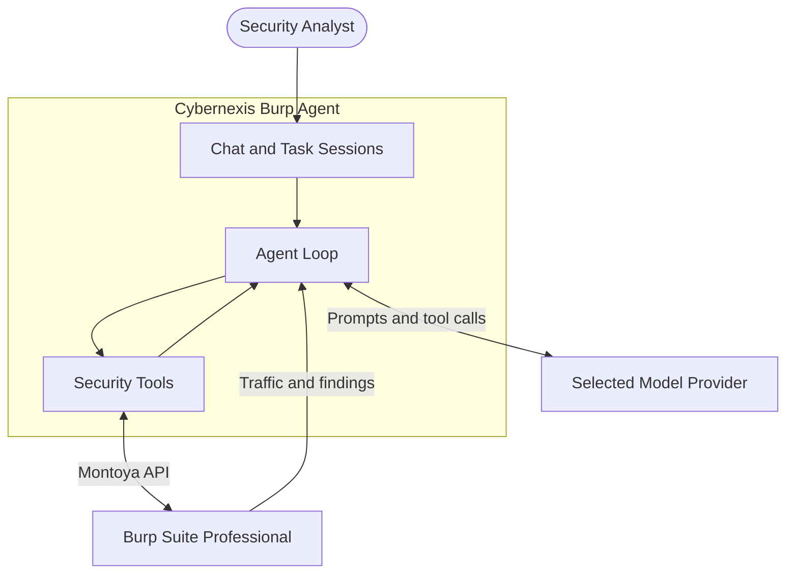

# Cybernexis Burp Suite Pro Agent

**Agentic security testing inside [Burp Suite](https://portswigger.net/burp), driven by local Ollama, OpenAI-compatible, or Anthropic models.**

[](#requirements)
[](#requirements)
[](#model-providers)
[](LICENSE)

Cybernexis Agent is a Burp extension: chat with an LLM that can inspect scope, sitemap, and issues, send requests, fuzz, spray credentials, and write findings back into Burp. With local Ollama, prompts stay on your machine. Remote providers receive the prompts and selected Burp traffic needed for the task.

It is **not** an LLM. You bring a tool-capable model through Ollama, an OpenAI-compatible endpoint, or Anthropic. It is **not** affiliated with PortSwigger.



## Screenshots

<p align="center">
  
</p>
<p align="center">
  
</p>
<p align="center">
  
</p>

## Features

- **Multi-task chat** — independent sessions with live request / tool-call counts, markdown answers, and native Burp request/response editors on tool cards
- **Approvals** — Manual, Smart (high-impact tools escalate), or Auto
- **Host focus** — naming a URL locks that task to that host (`www.` included; sibling subdomains stay out)
- **Variables** — `extract_from_response` → `{{csrf}}` in later `send_request` / `fuzz_request` / `brute_force`
- **Target memory** — durable per-host notes and a token map (JWT, UUID, CSRF, session cookies) across tasks
- **Live fuzzing** — status, length, reflection, error signatures, timing anomalies (blind SSRF / command injection)
- **Password spray** — built-in wordlists and `{{pass}}` / `{{user}}` markers; no huge lists pasted into the model
- **Model providers** — Ollama native, OpenAI-compatible Chat Completions, or Anthropic Messages; local or remote base URL
- **Optional passive scanner** — off by default; in-scope traffic → selected model → native Burp issues (`Cybernexis:`)
- **Right-click** — *Send to Cybernexis* from Proxy, Repeater, Target, or Scanner
- **Safety** — out-of-scope action tools can be blocked; conversation context is budgeted so long runs stay stable

## Requirements

| | |
|---|---|
| JDK | 11+ (Burp must run on a JDK if you use `run_custom_script`) |
| Maven | 3.8+ |
| Burp | Professional 2024.x+ (built against Montoya API `2025.12`) |
| Provider | Ollama, an OpenAI-compatible Chat Completions endpoint, or Anthropic |
| Model | tool-capable; for example a local Ollama model, an OpenAI API model, or a Claude model |

## Install

```bash
git clone https://github.com/caglarcakici/cybernexis-burp-agent.git
cd cybernexis-burp-agent
mvn -q package -DskipTests
```

1. Burp → **Extensions → Add** → type **Java** → select `target/cybernexis-agent.jar`
2. Open the **Cybernexis** suite tab
3. **Settings** — choose a provider protocol, set base URL, chat/models endpoints, model, and optional API token, then **Test connection** and **Save**

Unload any older build of the extension first so you do not get two suite tabs.

## Usage

Ask in **Chat**, for example:

- *What's in scope?*
- *List the sitemap for this host*
- *Inspect issue 3*
- *Send request 42 to Repeater*
- *Extract the CSRF token from message 10 and brute-force the login*

Right-click any HTTP message → **Send to Cybernexis** to start a task with that exchange loaded.

| Mode | Behaviour |
|---|---|
| **Manual** | Confirm every action tool |
| **Smart** | Auto-run most tools; ask for crawl, audit, fuzz, brute-force, scripts, and live `send_request` |
| **Auto** | Run everything |

Enable **Block action tools targeting out-of-scope hosts** in Settings unless you intend otherwise.

## Model providers

| Protocol | Default base URL | Authentication | Endpoint |
|---|---|---|---|
| **Ollama native** | `http://127.0.0.1:11434` | None; optional Bearer token for a protected gateway | `/api/chat` |
| **OpenAI-compatible** | `https://api.openai.com` | Bearer token | `/v1/chat/completions` |
| **Anthropic Messages** | `https://api.anthropic.com` | `x-api-key` token | `/v1/messages` |

Custom base URLs are supported, including gateways and self-hosted OpenAI-compatible servers. Chat and model-list endpoints are configured independently and accept either a relative path or a complete URL. A base URL may include the trailing `/v1`; Cybernexis avoids adding it twice.

For example, DeepSeek's OpenAI-compatible API uses base URL `https://api.deepseek.com`, chat endpoint `/chat/completions`, and models endpoint `/models`. Its Anthropic-compatible API can instead use protocol **Anthropic Messages**, base URL `https://api.deepseek.com/anthropic`, and chat endpoint `/v1/messages`.

API tokens are masked in the Settings UI and stored in Burp's extension preferences. Treat the Burp user profile as sensitive. Remote providers receive model prompts, tool results, and any Burp traffic included in those prompts. Review your provider's data policy before using remote models with confidential targets.

## Tools (overview)

The model only calls names from the live catalog. Highlights:

| Area | Examples |
|---|---|
| Recon | `inspect_scope`, `list_sitemap`, `list_issues`, `search_http_messages` |
| HTTP | `inspect_http_message`, `send_request`, `send_to` |
| Attack | `fuzz_request`, `brute_force`, `crawl_and_audit`, `audit_request` |
| Session | `extract_from_response`, `set_variable`, `remember`, `scan_tokens` |
| Other | Collaborator, Organizer, BChecks, `run_custom_script`, compare, hash/encode |

`fuzz_request` sends payloads through Burp (not only Intruder staging). `brute_force` uses built-in lists (`passwords-top100` / `top250` / `top500`) and clusters responses for likely hits and lockouts.

## Configuration

Persisted in Burp preferences (survives reload):

- Provider protocol, base URL, chat/models endpoints, model, API token, temperature, max tokens / steps / timeout
- Context budget (characters kept per turn)
- Default approval mode
- Scope enforcement
- Passive scanner (default **off**)

## Build from source

```bash
mvn test package
```

Loadable shaded jar: `target/cybernexis-agent.jar`. Flexmark is bundled; the Montoya API is `provided` by Burp.

## Responsible use

Only test systems you are authorized to test. High-impact tools send live traffic. Keep **Smart** or **Manual** mode unless you trust the current target and model.

## Disclaimer

Cybernexis Agent is an independent open-source extension. It is not affiliated with, endorsed by, or sponsored by PortSwigger Ltd. Burp Suite is a trademark of PortSwigger Ltd.

## License

[MIT](LICENSE)
